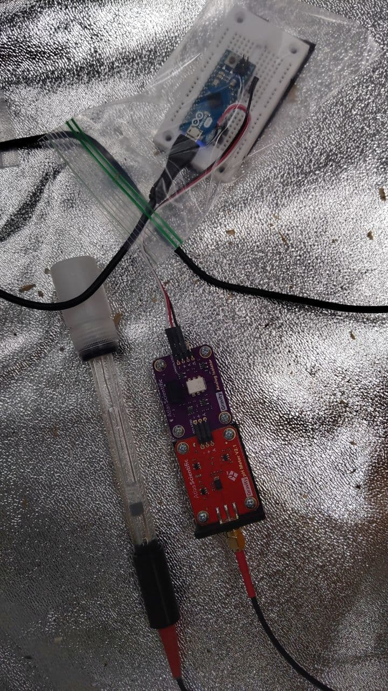

# pH-Tester-arduinoMicro

This is made for the Atlas Scientific Gravity Analog pH tester kit.  This source code is modified from the original example provided by Atlas Scientific.

This communicates over USB serial. (9600 baud,  Carriage Return delimiter)

# Commands

- `PING` : responds with "PONG"  (useful for determine if system is awake
- `CAL,7` : calibrates the probe for pH level 7. Responds with "**c:MID**" This is stored in the EEPROM
- `CAL,4` : calibrates the probe for pH level 4. Responds with "**c:LOW**" This is stored in the EEPROM
- `CAL,10` : calibrates the probe for pH level 10. Responds with "**c:HIGH**" This is stored in the EEPROM
- `CAL,CLEAR` : erases calibration data from the EEPROM.
- `STATUS` : Responds with 
  - "**s:0:Failed to load EEPROM!**"
  - "**s:1:EEPROM Loaded Successfully**"
  - "**s:##:Unknown Status Code**"   (where ## is a number.   This should never happen)
- `GET_PH` : Responds with the current pH reading. 
- `READ_DATA` : Will continuously respond with the current pH reading every second until `STOP_DATA` is sent.
- `STOP_DATA` : [RTFM](https://en.wikipedia.org/wiki/RTFM)

# Hardware Setup

Just follow the wiring diagram on Atlas Scientific's website for the Analog pH meter.  (The pinout for the isolater chip is the same. Ignore the "square wave" pin.)

I used 2 generic "Portion Pack" bags to isolate and protect the arduino and the sensor boards from moisture, while I work on a 3d print enclosure.
